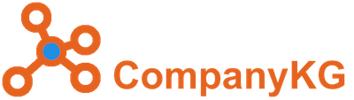
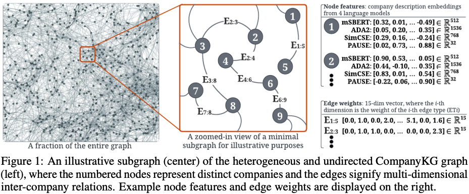

## A Large-Scale Heterogeneous Graph for Company Similarity Quantification

<div>
<p align="left">
  <a href="#setup">Setup</a> •
  <a href="#basic-usage">Usage</a> •
  <a href="https://zenodo.org/record/8010239">Dataset</a> •
  <a href="#training-benchmark-models">Benchmark</a> •
  <a href="https://github.com/EQTPartners/CompanyKG/blob/main/tutorials/tutorial.ipynb">Tutorial</a> •
  <a href="https://arxiv.org/abs/2306.10649">Paper</a> •
  <a href="#external-results">External Results</a> •
  <a href="#cite-this-work">Citation</a> 
</p>

</div>

[](https://github.com/EQTPartners/CompanyKG/releases/tag/1.1)
[](https://www.python.org/doc/versions/)
[](https://motherbrain.ai/)

This repository contains all code released to accompany the release of the CompanyKG
knowledge graph illustrated in Figure 1 below. 
For details of the dataset and benchmark experiments, see the official release of the [paper](https://arxiv.org/abs/2306.10649) and [dataset](https://zenodo.org/record/8010239).



There are two main parts to the code release:
* CompanyKG dataset access and task evaluations (see below)
* [Benchmark model training and experiments](./benchmarks/README.md)


## Pre-Requisites

* Python 3.8

There are also optional dependencies, if you want to be able to convert the KG
to one of the data structures used by these packages:

* [DGL](https://pypi.org/project/dgl/): `dgl`
* [iGraph](https://pypi.org/project/python-igraph/): `python-igraph`
* [PyTorch Geometric (PyG)](https://pypi.org/project/torch-geometric/): `torch-geometric`


## Setup

The `companykg` Python package provides a data structure to load CompanyKG into memory,
convert between different graph representations and run evaluation of trained embeddings
or other company-ranking predictors on three evaluation tasks.

To install the `comapnykg` package and its Python dependencies, activate a virtual 
environment (such as [Virtualenv](https://github.com/pyenv/pyenv-virtualenv) or Conda) and run:

```bash
pip install -e .
```

The first time you instantiate the CompanyKG class, if the dataset is not already available
(in the default subdirectory or another location you specify), the latest version will be automatically
downloaded from Zenodo.


## Basic usage

By default, the CompanyKG dataset will be loaded from (and, if necessary, downloaded to) 
a `data` subdirectory of the working directory. To load the dataset from this default location,
simply instantiate the `CompanyKG` class:
```python
from companykg import CompanyKG

ckg = CompanyKG()
```

If you have already downloaded the dataset and want to
load it from its current location, specify the path:
```python
ckg = CompanyKG(data_root_folder="/path/to/stored/companykg/directory")
```

The graph can be loaded with different vector representations (embeddings) of
company description data associated with the nodes: `msbert` (mSBERT), `simcse`(SimCSE), 
`ada2` (ADA2) or `pause` (PAUSE).

```python
ckg = CompanyKG(nodes_feature_type="pause")
```

If you want to experiment with different embedding types, you can also load embeddings
of a different type into an already-loaded graph:

```python
ckg.change_feature_type("simcse")
```

By default, edge weights are not loaded into the graph. To change this use:
```python
ckg = CompanyKG(load_edges_weights=True)
```


A tutorial showing further ways to use CompanyKG is [here](./tutorials/tutorial.ipynb).


## Training benchmark models

Implementations of various benchmark graph-based learning models are provided in this repository.

To use them, install the `ckg_benchmarks` Python package, along with its dependencies, from the
`benchmarks` subdirectory. First install `companykg` as above and then:

```bash
cd benchmarks
pip install -e .
```

Further instructions for using the benchmarks package for model training and provided in
the [benchmarks README file](./benchmarks/README.md).


## External Results
We collect all benchmarking results on this dataset here. Welcome to reach out to us (via github issue or [email shown in our paper](https://arxiv.org/pdf/2306.10649.pdf)) if you wish to include your experimental results.
- [Knorreman](https://github.com/Knorreman/fastRP) reported results using [fastRP algorithm](https://arxiv.org/pdf/1908.11512.pdf) achieving [competitive results](https://github.com/EQTPartners/CompanyKG/issues/1#issuecomment-1749707045) (i.e., `sp_auc=85.7%`, `sr_test_acc=69.2%`, `R@50=0.353`, and `R@100=0.430` obtained on different hyper-parameters and initial node embeddings).


## Cite This Work

Cite the [paper](https://arxiv.org/abs/2306.10649):
```bibtex
@article{cao2023companykg,
    author = {Lele Cao and
              Vilhelm von Ehrenheim and
              Mark Granroth-Wilding and
              Richard Anselmo Stahl and
              Drew McCornack and
              Armin Catovic and
              Dhiana Deva Cavacanti Rocha},
    title = {{CompanyKG: A Large-Scale Heterogeneous Graph for Company Similarity Quantification}},
    journal = {IEEE Transactions on Big Data},
    year = {2024},
    doi = {10.1109/TBDATA.2024.3407573}
}
```

Cite the [official release of the CompanyKG dataset on Zenodo](https://zenodo.org/record/8010239):
```bibtex
@article{companykg_2023_8010239,
    author = {Lele Cao and
              Vilhelm von Ehrenheim and
              Mark Granroth-Wilding and
              Richard Anselmo Stahl and
              Drew McCornack and
              Armin Catovic and
              Dhiana Deva Cavacanti Rocha},
    title = {{CompanyKG Dataset: A Large-Scale Heterogeneous Graph for Company Similarity Quantification}},
    month = June,
    year = 2023,
    publisher = {Zenodo},
    version = {1.1},
    doi = {10.5281/zenodo.8010239},
    url = {https://doi.org/10.5281/zenodo.8010239}
}
```
